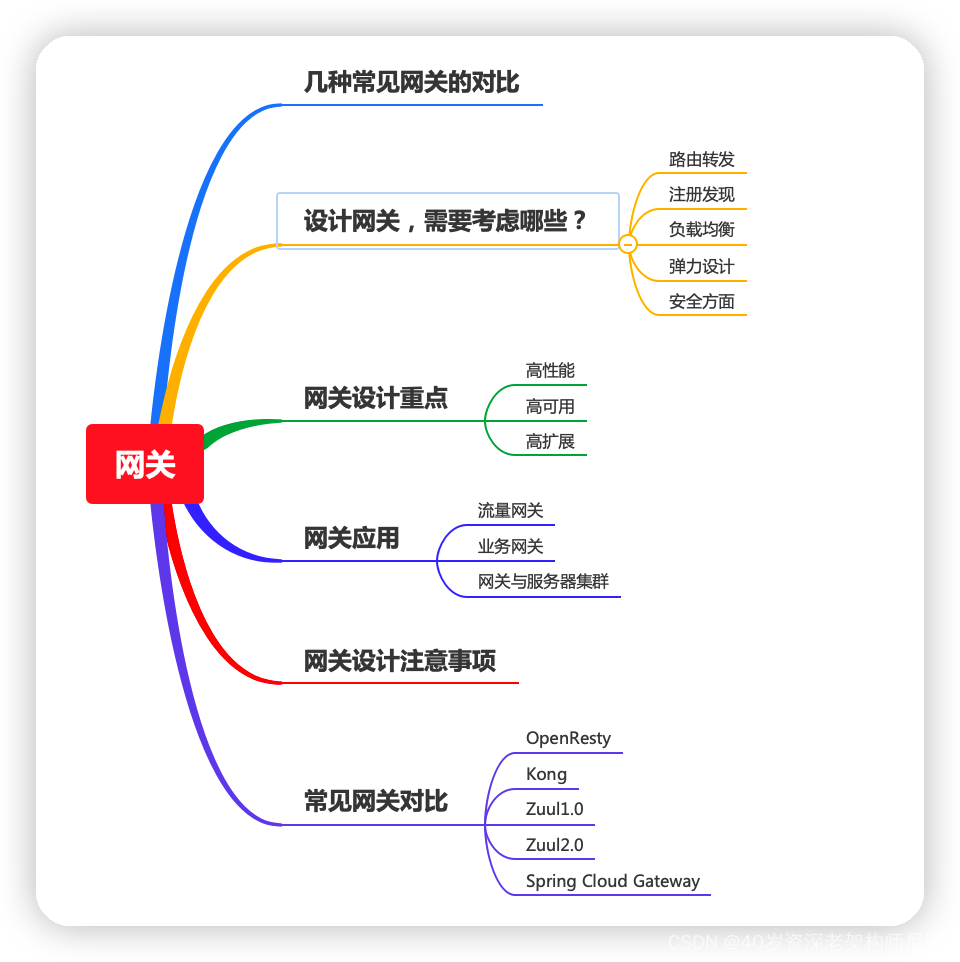

# nginx-modules

**拒绝内卷，创造神话**

* 一站式nginx http网关 二次开发 与运维升级。
* nginx service mesh二次开发 与运维升级。
* sidecar轻量级代理网关。

## service-mesh

- [service-mesh](./service-mesh/README.md)

## api-gateway

API网关
- [api-gateway](/api_gateway.md)



## nginx


## nginx-consul完美组合：

（1）服务发现API网关；
（2）后端微服务架构：负载均衡；
	
## nginx
（1）http/https API网关：限流，黑白名单，接入控制；—— 成熟的lua插件，C module；
（2）http2;
（3）http CDN代理缓存；
（4）upsteram静态负载均衡；（4层，7层负载均衡）；
（5）c module插件开发，做点播/直播的转码转封装框架；

## consul
（1）microservice服务发现；
（2）key/value配置中心；
（3）health健康检测；
（4）与nginx结合，实现（4层/7层）动态负载均衡；


## LVS

- [LVS的负载调度算法](/LVS的负载调度算法.md)

# C++11

- [c++11编程注意事项](/cplusplus/README.md)
- [c++11中thread的join用法](./doc/c++11中thread的join用法.md)

- [c++11 cast标准写法](./c++11_cast.md)
- [使用stl中的advance和distance方法来进行iterator的加减](/cplusplus/使用stl中的advance和distance方法来进行iterator的加减.md)

## g++4.6 atomic and pair兼容

- [g++4.6 atomic and pair兼容](/cplusplus/atomic/make_pair_error.md)

## json

* c++ json解析

- [https://github.com/nlohmann/json](https://github.com/nlohmann/json)

# thread

## pthread_kill

函数pthread_kill()向同一进程下的另一线程发送信号。因为仅在同一进程中可保证线程ID的唯一性，所以无法调用pthread_kill向其他进程中的线程发送信号。

# go

- [Go如何优雅的解决方法重载的问题](/go/Go如何优雅的解决方法重载的问题.md)

- [go语言内存对齐](/doc/go语言内存对齐.md)

- [c++与golang map拷贝的区别](/doc/cpp-and-golang-map.md)

- [golang-map和slice深拷贝](/go/golang-map和slice深拷贝.md)

- [https://go.dev/](https://go.dev/)

- [http://c.biancheng.net/view/94.html](http://c.biancheng.net/view/94.html)

- [go-redis-cluster读写分离](./go-redis-cluster读写分离.md)

- [go-mysql](./go-mysql.md)

- [go-sync.Once](./go-sync.Once.md)

- [Golang结构体类型的深浅拷贝](./Golang结构体类型的深浅拷贝.md)

- [go-fmt](https://www.liwenzhou.com/posts/Go/go_fmt/)

- [go-testing](/go/go-testing/go-testing.md)


# rotate

* 日志分割与压缩 采用rename(mv)
```
mv  xxx.log  xxx.log.1
gzip xxx.log.1
```


* 不要采用，否则进程找不到描述符，没法再打印日志。
```
rm xxx.log
```
可以用
```
tar -czvf xxx.log.tar.gz ./xxx.log
echo "" > xxx.log
```


# ab压测

- [ab压测](doc/ab-perf.md)

# git

- [git合并分支到master](./doc/git合并分支到master.md)
- [git_submodule](./doc/git_submodule.md)


# linux工具

* top
* netstat
  * netstat -tlpn | grep xxx
  * netstat -tpn | grep xxxx
* lsof -p [pid]

* tcpdump

- [/proc/stat解析](/doc/proc_stat解析.md)
- [topic-top](/doc/topic-top.md)

- [docker启动模式](/docker启动模式.md)

## 通过netstat和lsof查询 本端和对端服务进程信息

## 安装netstat

Ubuntu 20.04 安装netstat工具
```
sudo apt install net-tools
```

## linux配置

/etc/hosts

/etc/resolv.conf 

/etc/apt/sources.list

## sed和awk

- [sed和awk](/doc/sed-awk.md)
- [awk 入门教程](https://www.ruanyifeng.com/blog/2018/11/awk.html)

## 构建docker镜像

- [构建Docker镜像](/doc/构建Docker镜像.md)

## git操作

* 清除本地用户信息
```
git config --system --unset credential.helper
```

* 保存本地用户信息
```
git config --global credential.helper store
```

## base64

- [https://tool.oschina.net/encrypt?type=3](https://tool.oschina.net/encrypt?type=3)

# 小结

* 后端开发技术
  在开发需求的角度，如果有一定工作经验，比较简单。
  
  更重要的是多做积累和开发调试工具，方便监控和定位问题。

* 多借鉴开源技术
 
* 读代码可以读到人心

  通过一部分项目代码就可以看出：（如一个段代码的嵌套层数，1个function代码行数等）
  * 是否经过比较正规的代码规范编写
  * 或是否进过大公司
  * 或是否读过优秀的代码（或开源代码）；

* 不背锅，不甩锅

* 做后端 要善于使用工具，善于开发工具；应用到开发和监控。 而不是简单的完成一个接一个的需求。
  * 好的工具 事半功倍。

* 做事要严谨，尽量做到滴水不漏
  * 做事要严谨，尽量做到滴水不漏。做的每一步操作 分析得非常清楚。
  * 做完项目后，要评论、思考这个项目做的好不好。而不是说提前2天做完了，做完了就结束了。-- 这样才有进步和提升。

## 技术总结

1. http-api网关： openresty(nginx+lua)  不管是大体量 还是小体量业务。都或多或少可能面临被攻击的风险。 采用nginx网关开发一些lua插件，开发效率高，性能好。
2. golang/nodejs开发业务效率高；
3. rtc音视频： C++是必备条件，音视频传输，音视频处理； 音视频sdk。
4. 积极拥抱开源，在开源的基础上做二次开发。

## 解决问题的能力

* 分析问题
* 复现问题
* 解决问题

## 对AI技术的理解

对AI技术要有一个比较正确的理解，在很大程度上，AI技术只是一个辅助手段。

1. 在直播公司，AI瘦脸技术，抠图等要多实践。-- 价值比较高。
   * 这些技术是在直播系统比较成熟、稳定的基础上去实践。

2. 挂机，低质识别，优质推荐。
   * 这些用AI技术存在一定的忽悠成分，非常烧钱。不要被一些只会demo的AI算法人员（没有工程实践经验）主导。
   * 这些功能 多采用统计学的方法 去实践，效果更好，成本更低。
   * 另外，采用音视频基础技术去做一些低质识别（如检测主播端的设备、画质、码率、分辨率等）。 -- 更加利用直播技术良性发展。

## 技术（工作）氛围

* 【好的氛围】用到的技术，写的代码 还是比其他团队 高级些。多对比、参考业界做法。

* 【差的氛围】其他团队 就是rpc/crud，并且使用时 首先考虑到的是怎么规避技术风险，把甩锅都准备好了。
  * 这样的团队死水一团。
  * 以完成任务（及格就行）为首要目标； -- 不利于团队的技术提升，成员个人成长。

### 大忌讳

* 又想马儿跑，又想马儿不吃草
  * 画大饼的做法已过时，行不通。

* 在已经没有任何物质奖励，形势非常恶劣的前提下，画大饼也是苍白无力的。

## 后端研发的核心能力培养

* 紧急需求，快速开发，并保证开发质量 -- 必备

* 核心竞争力： 
  * 分析定位，解决难点问题；
    * 分析日志，从日志中提炼有效信息，像侦探断案一样；
    * 复现问题；-- 特别是在模拟、测试环境复现问题；
    * 量化分析： 如通过日志统计QPS；
    * 监控工具：批量监控脚本 上传部署等；

* 总结、思考、积累
  * 假设

* `熟练使用分析cpu，memory, net的工具`；

## 语言使用感悟

* nodejs还是比较适合搞前端，前后端分离；另外nodejs适合做webrtc客户端和部分后端；
* golang、c/c++做后端；
* 要了解nodejs 前后端分离的一些细节，特别是 64bit等的处理，整型精度丢失等。

## 后端技术感悟

* 善于使用工具
* 善于开发辅助工具

提供工作效率，降低出错率。

## 开源感悟

* 开源一个api网关，就一定要跟nginx比吗？ 承认性能比nginx很难吗？
  * 甚至api网关中的控制面 网页配置方法也一定要用一个简单的go后端 + vue/react实现。 -- 难道 权限管理，ip白名单，限流等比nginx成熟。-- 特别是ip白名单控制。

## 个人感悟

1. 一定不要轻易否定别人的劳动成果。
  * 让别人配合执行一项任务时，一开始的基调就是很简单；
    * 实质里面的细节很多，需要花时间。-- 自己实践了才会有感悟，没那么简单。
  * 什么高价值就是扯淡。

2. 不要羡慕比人做AI项目的，每个人专注的点不同
   * 我在nginx http网关，轻量级代理 研究得比较深；
   * 在音视频领域（如ffmpeg转码，混流混画等），也是有自己的专长的。

# FAQ

## 浏览器访问跨域问题

- [浏览器访问跨域问题](doc/浏览器访问跨域问题.md)

## nginx与bfe比较

* 服务器是重资产，人员配置是轻资产。bfe使用15台机器性能来对标nginx 10台机器，对于中小企业尽量使用少的机器，易维护性的成熟软件，并且nginx代理运维成本更低。
* 另外，还有一些其他公司开源的golang负载均衡软件在协议栈方面做了深度优化，也非常不错。

# 参考链接

- [https://en.wikipedia.org/wiki/Reserved_IP_addresses](https://en.wikipedia.org/wiki/Reserved_IP_addresses)
- [https://github.com/apache/arrow](https://github.com/apache/arrow)
- [怎么去控制浏览器对资源文件的处理行为](https://segmentfault.com/a/1190000015430643)
