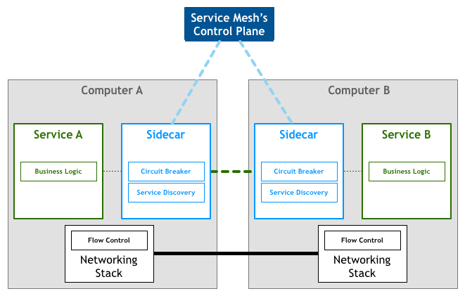

# 微服务发展历程

## 

## 第1代微服务架构

## 第2代微服务架构

调用方 需要自己做流量管控，注册或订阅后端服务。

### 缺点

* 侵入性强。想要集成SDK，或使用定制化的rpc框架（如服务注册，服务订阅，流量控制sdk，rpc收发框架）；
* 升级成本高。每次升级都需要业务应用修改SDK版本，重新进行功能回归测试，重新部署升级。

## 第3代微服务架构

第三代微服务架构：service-mesh云原生解决方案

优点： 
* 业务 与 agent(数据面)完全解耦；
  * 业务不需要集成sdk或定制化的rpc框架。agent里面实现了这些基础组件，只需要使用方通过控制面下发配置。

